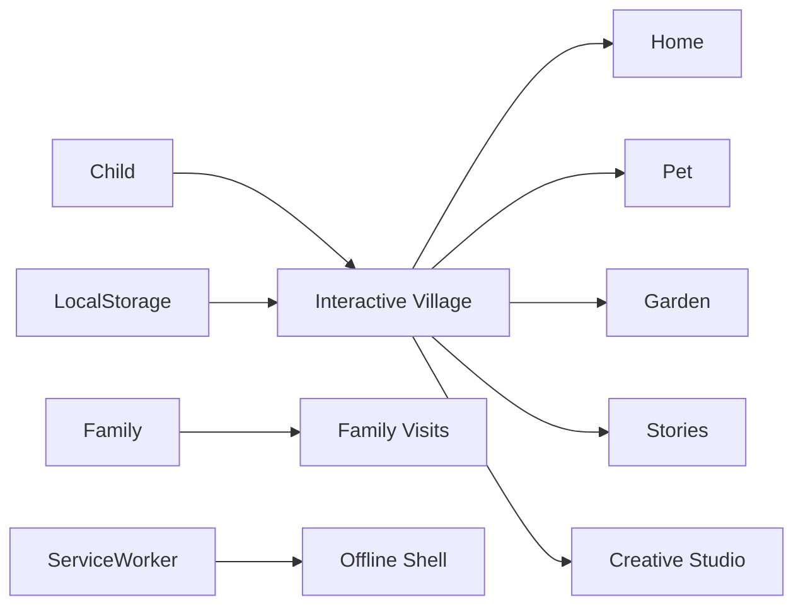

# Little Wonder World

> A world that moves at your child’s pace.

Little Wonder World is a calm, family-centered digital village for gentle exploration, creativity, stories, and care. Children can tend a garden, look after a pet, discover bedtime stories, make art, experience seasons, and welcome family avatars—with no ads, timers, streaks, scores, or pressure to win.


## What we are trying to create

Many children’s apps are designed around urgency, rewards, and endless engagement. This project explores a different model: technology as a quiet shared space that respects attention and invites imagination.

The showcase demonstrates how thoughtful frontend engineering can support child-led play while giving grown-ups confidence through privacy, accessibility, offline support, and clear family controls.

## Experience highlights

- Cozy interactive village with home, garden, story nook, and art studio
- Pet care and garden changes remembered locally across visits
- Sunny, rainy, and nighttime weather plus four seasons
- Bedtime story and daily surprise experiences
- Family avatar visits that never interrupt a child’s play
- Separate grown-up controls and calm, non-competitive language
- Responsive design, keyboard focus, reduced motion, PWA manifest, service worker, and offline cache

## Architecture



## Setup

```bash
npm install
npm run dev -- --port 3008
```

## Commands

| Command                      | Purpose                       |
| ---------------------------- | ----------------------------- |
| `npm run dev -- --port 3008` | Start the app locally         |
| `npm run typecheck`          | Validate TypeScript           |
| `npm test`                   | Run world-state tests         |
| `npm run lint`               | Run ESLint                    |
| `npm run build`              | Create a production build     |
| `npm run check`              | Run the complete quality gate |

## Design tradeoffs

- Device-local persistence demonstrates privacy-first state without collecting children’s data.
- The service worker provides an offline-ready shell; a production app would use explicit content-version and storage policies.
- Family avatars are authored demo identities. Real invitations would require verified grown-up accounts, consent, and child-safety controls.
- CSS-built scenery keeps the experience responsive and lightweight while showcasing frontend craft.

## Roadmap

- Avatar and house customization
- Accessible drawing studio with saved creations
- Grown-up-authored family stories and voice recordings
- Seasonal celebrations and child-controlled birthday moments
- Multi-language narration and dyslexia-friendly reading modes
- Robust content moderation, parental consent, and encrypted family sync

## Interview talking points

- Designing engagement without dark patterns
- Separating child and grown-up interaction models
- Persisting meaningful state without collecting personal data
- Progressive enhancement for offline play
- Accessible motion, focus, language, and responsive spatial UI
- Production safety requirements for family and children’s products

## License

MIT
