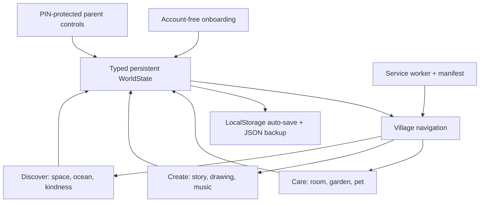

# Little Wonder World

Little Wonder World is a calm, account-free digital play space for children. It turns one persistent magical village into a room decorator, garden, pet-care home, story maker, art studio, music garden, space and ocean discovery world, kindness ritual, and forever reward shelf. There are no ads, streaks, countdowns, losing states, or negative scores.

## Why this project exists

Most children’s apps optimize for attention. This project explores a different product question: **can a rich, polished app invite creativity and family connection without pressure?** It is also a production-style frontend showcase covering persistent domain modeling, accessible multimodal interactions, animation, offline behavior, responsive UI, testing, and CI/CD.

## Complete experience

- Account-free onboarding with avatar, optional name, and automatic resume.
- Animated day/night village with clouds, birds, swaying trees, and responsive objects.
- Room decoration with 50 items, drag/tap placement, snapping, feedback, undo, redo, and reset.
- Persistent multi-stage garden and pet-care simulation.
- Deterministic story builder with illustrations, narration, a saved shelf, and valid PDF export.
- Touch/mouse drawing canvas with brushes, stickers, undo/redo, draft auto-save, gallery, and PNG export.
- Seven-note music garden with overlapping Web Audio notes, recording, replay, and saved songs.
- Animated space and ocean worlds with facts, collectible discoveries, progressive fish unlocks, and random rare encounters.
- One kindness mission per day and permanent, requirement-driven achievements with celebratory confetti.
- PIN-protected parent dashboard for screen-time reminders, sound, language, accessibility, exports, backup, and restore.
- Manual save, 30-second auto-save, friendly save recovery, local persistence, installable PWA, and offline shell.
- High contrast, dyslexia-friendly type, narration, 44 px touch targets, keyboard support, reduced motion, and responsive layouts.

## Architecture



The UI is a focused React state machine backed by one typed, versioned domain object. Each activity owns its transient interaction state while durable progress flows into `WorldState`. That keeps the account-free product easy to restore, export, test, and evolve.

## Run locally

```bash
npm install
npm run dev
```

For a production build:

```bash
npm run build
npm start
```

## Quality checks

```bash
npm run typecheck
npm test
npm run test:coverage
npm run lint
npm run build
npm run format:check
npm run test:e2e
```

The Playwright suite runs desktop and mobile Chromium smoke journeys. GitHub Actions runs the same quality gate on pushes and pull requests.

## Acceptance coverage

All 18 epics are implemented. The criterion-by-criterion evidence and verification notes are in [ACCEPTANCE.md](./ACCEPTANCE.md).

| Area            | Included                                                                       |
| --------------- | ------------------------------------------------------------------------------ |
| Core world      | Onboarding, village, room, garden, pet                                         |
| Creativity      | Story builder, drawing studio, music playground                                |
| Discovery       | Space, ocean, daily kindness, permanent rewards                                |
| Family controls | PIN, time reminder, sound, language, export, backup/restore                    |
| Quality         | Accessibility modes, responsive UI, offline PWA, auto-save, reduced motion, CI |

## Privacy and product tradeoffs

- Progress is device-local by design. This protects children from account collection, but it does not sync across devices; JSON backup/restore is the explicit family-controlled alternative.
- Stories are deterministic and offline-safe. A future opt-in AI service could add more variety, but would require parental consent, moderation, cost controls, and a child-privacy review.
- Audio uses browser-native speech and Web Audio, avoiding third-party tracking but producing slightly different voices across operating systems.
- CSS animation keeps the runtime small. Decorative motion is disabled when the device requests reduced motion.

## Screenshots

> Add final desktop, tablet, mobile, story, drawing, and parent-dashboard screenshots here after the public release is approved.

## Roadmap

- Optional encrypted family sync with verifiable parental consent.
- More story branches, brushes, instruments, planets, and seasonal village scenes.
- Localized activity copy beyond the current greeting and parent preference.
- Automated visual regression and scheduled Lighthouse monitoring.

## Interview talking points

- Modeling many independent game systems inside one durable, versioned state boundary.
- Designing pointer, touch, keyboard, screen-reader, and reduced-motion equivalents.
- Building child-safe engagement without timers, ads, loss mechanics, or dark patterns.
- Balancing offline-first privacy against cross-device convenience.
- Testing behavior at helper, integration, mobile, desktop, and production-build levels.
