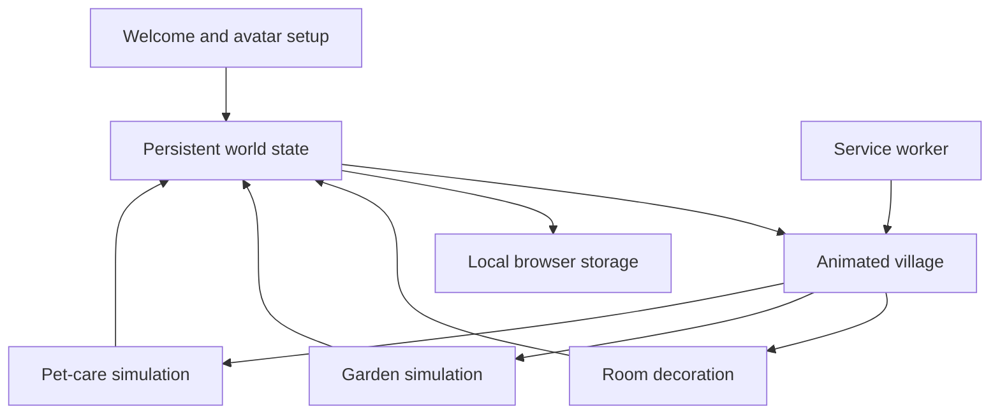

# Little Wonder World

Little Wonder World is a calm, account-free digital play space for children. It is designed around exploration, creativity, and caring—not timers, losing, advertisements, or pressure.

The current release is the first complete product milestone. It implements the first five acceptance-criteria epics as real gameplay systems rather than static demos.

## What children can do

- Start immediately without an account or login.
- Choose an avatar and optionally enter a name.
- Return later to the same locally saved world.
- Explore an animated day/night village with moving clouds, birds, swaying trees, and touch reactions.
- Decorate a room using 50 draggable and tap-accessible objects.
- Snap decorations into valid room locations, receive invalid-placement feedback, undo, redo, and reset.
- Plant sunflowers, strawberries, and tulips; water them through multiple growth stages; harvest mature plants for stars.
- Adopt a puppy, kitten, or panda.
- Care for hunger, happiness, energy, and cleanliness through feeding, playing, sleeping, and bathing.

## Product principles

- No child account or personal-data collection.
- No ads, streaks, countdowns, negative scoring, or failure states.
- Large touch targets and complete keyboard navigation.
- Reduced-motion support through the operating-system preference.
- Device-local progress using browser storage, matching the account-free acceptance criteria.
- Offline shell support through a service worker and web app manifest.

## Architecture



The interface is implemented as a focused React state machine. The four main screens share one typed `WorldState`, which is automatically restored and saved. Gameplay helpers are tested independently, while browser acceptance testing verifies the complete child journey.

## Run locally

```bash
npm install
npm run dev
```

Open the local URL printed by the development server.

## Quality checks

```bash
npm run typecheck
npm test
npm run lint
npm run build
npm run format:check
```

## Acceptance coverage

| Epic               | Status   | Included in this milestone                                            |
| ------------------ | -------- | --------------------------------------------------------------------- |
| 1. User onboarding | Complete | Account-free start, avatar, optional name, local resume               |
| 2. Home village    | Complete | Ambient motion, day/night, interactive objects, persisted progress    |
| 3. Room decoration | Complete | 50 objects, drag/tap placement, snapping, feedback, undo/redo/reset   |
| 4. Garden          | Complete | Three plant types, growth stages, watering, bloom, harvest rewards    |
| 5. Pet care        | Complete | Adoption, four wellness stats, four care actions, reactions and sound |
| 6–12               | Roadmap  | Story creation, drawing, music, space, ocean, kindness, rewards       |
| 13–15              | Roadmap  | Parent dashboard, expanded accessibility, formal performance audits   |

## Next milestones

1. Story Builder with illustrated branching stories, narration, history, and PDF export.
2. Touch drawing studio with brushes, stickers, undo/redo, autosave, and export.
3. Music playground with synchronized instruments and recording.
4. Space and ocean discovery worlds.
5. Daily kindness, expanded rewards, and a PIN-protected parent dashboard.
6. Formal WCAG and Lighthouse audits with documented performance budgets.

## Interview talking points

- Designing one persistent domain model for several independent game systems.
- Providing equivalent pointer, touch, and keyboard interactions for decoration.
- Separating gentle child-facing feedback from conventional competitive game loops.
- Building motion-rich scenes with CSS while respecting reduced-motion preferences.
- Keeping an account-free product useful offline without collecting child data.
